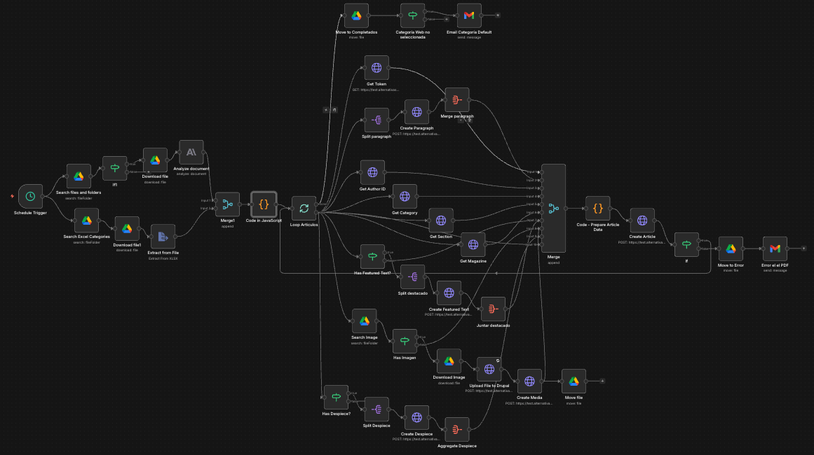

# AlterEco Publishing Pipeline

End-to-end publishing automation for Alternativas Económicas, a Spanish economics magazine. PDF articles are dropped into a Google Drive folder and published to Drupal automatically — extracted, structured, categorised, and assembled without manual intervention. Processing time went from roughly 30 minutes per article to 2–3 minutes.

---

## Problem

Every article required the same manual work: open the PDF, extract the text, identify paragraph types (body, pull quotes, sidebars, book reviews, interview questions), look up the author and category in a separate Excel sheet, source the featured image from Google Drive, create each content block in Drupal individually, and finally publish the node with all relationships mapped correctly. Around 12 steps, 30 minutes, every article.

The specific challenge is that standard text extraction tools produce a flat stream of text — they discard the layout information that tells you which paragraphs are pull quotes, which are sidebars (despieces), and which are body copy. Getting that structure right required a human reading the page.

---

## Solution Architecture

```
Schedule Trigger
           │
           ├──────────────────────────────────┐
           ▼                                  ▼
Search files and folders              Search Excel Categories
(Google Drive: entrada folder)        (Google Drive: Excel - Entrada)
           │                                  │
       If file exists?                Download Excel file
           │                                  │
           ▼                          Extract from File (xlsx)
     Download file (PDF)                      │
           │                                  │
           ▼                                  │
    Analyze document                          │
    (Claude Sonnet - Vision)                  │
           │                                  │
           └──────────────┬───────────────────┘
                          ▼
                        Merge1
                          │
                          ▼
               Code in JavaScript
               - Parse Claude JSON output
               - Clean invisible characters
               - Convert plain text to HTML
                 (paragraphs, h3, interview bold)
               - Substring match title against Excel
               - Separate lead from textos_destacados
               - Flag needs_review if no Excel match
               - Handle es_multiple (book reviews)
                          │
                          ▼
                   Loop Articulos
                   (one article at a time)
                          │
          ┌───────────────┼───────────────────────────────┐
          │               │                               │
          ▼               ▼                               ▼
   Split paragraph   Get Token (Drupal)            Get Author ID
   → Create Paragraph  (CSRF token)               Get Category
   → Merge paragraph                              Get Section
                                                  Get Magazine
          │               │                               │
          │               │         ┌─────────────────────┤
          │               │         ▼                     │
          │               │   Has Featured Text?          │
          │               │   → Split destacado           │
          │               │   → Create Featured Text      │
          │               │   → Juntar destacado          │
          │               │                               │
          │               │   Has Despiece?               │
          │               │   → Split Despiece            │
          │               │   → Create Despiece           │
          │               │   → Aggregate Despiece        │
          │               │                               │
          │               │   Search Image                │
          │               │   → Has Imagen?               │
          │               │   → Download Image            │
          │               │   → Upload File to Drupal     │
          │               │   → Create Media              │
          │               │                               │
          └───────────────┴──────────────┬────────────────┘
                                         ▼
                               Code - Prepare Article Data
                               - Assembles content_blocks array
                               - Maps all IDs (author, category,
                                 section, magazine, media)
                               - Falls back to "Redacción" if
                                 no author found
                                         │
                                         ▼
                                  Create Article
                                  (POST to Drupal JSON:API)
                                         │
                                    Article created?
                                    ┌────┴────┐
                                    ▼         ▼
                              Loop next    Move to Error
                              article      → Email error alert
                                │
                          Move to Completados
                                │
                       Categoría Web no seleccionada?
                            ┌───┴───┐
                            ▼       ▼
                     Email alert   done
                     (default cat
                      was used)
```

---

## Key Implementation Details

### Claude Vision for layout-aware extraction

The workflow sends the PDF binary directly to Claude Sonnet via the Anthropic node. The extraction prompt (written in Spanish, matching the magazine's language) instructs the model to identify and separately return:

- Body paragraphs as plain text with double line breaks between paragraphs
- Subtitles marked with `### ` prefix
- Pull quotes and highlighted texts (`textos_destacados`) — capped at 250 characters
- Article lead (`entradilla`) — always required, never empty
- Sidebars (`despieces`) typed as `quien_es`, `para_saber_mas`, or `ficha_libro`
- Interview questions marked with `### ` so they render as bold paragraphs in Drupal
- Book review sections when the PDF contains multiple reviews (`es_multiple: true`)

The model is instructed to return only valid JSON with no markdown fencing, and to use single quotes instead of double quotes within content strings to avoid breaking the JSON structure.

### JavaScript Code nodes for data transformation

Two JavaScript Code nodes handle the heavy data transformation work that sits between the AI extraction and the Drupal API calls.

The first Code node (`Code in JavaScript`) receives the merged output from Claude and the Excel file and does the following in a single pass:

- Strips markdown code fences from the Claude response if present
- Normalises smart quotes and invisible Unicode characters (`\u2063`, `\u200B`, `\u00A0`, `\uFEFF`)
- Converts plain text content to HTML — wrapping paragraphs in `<p>` tags, converting `### ` prefixes to `<h3>` for standard articles and `<p><strong>` for interviews
- Splits HTML content into sections for Drupal's paragraph blocks
- Matches the extracted article title against the Excel sheet to resolve web category and magazine section — normalising accents, case, and invisible characters before comparing, then checking if either string contains the other as a substring
- Separates lead text from pull quotes, and filters out any pull quote exceeding 255 characters
- Sets `needs_review: true` and assigns default categories if no Excel match is found, so the downstream alert can flag these for manual correction
- Handles the `es_multiple` case by returning one output item per book review

The second Code node (`Code - Prepare Article Data`) runs after all parallel Drupal API lookups have completed and assembles the final article payload — collecting all paragraph IDs, featured text IDs, despiece IDs, author ID, category ID, section ID, magazine ID, and media ID into a single `content_blocks` array ready for the Create Article POST.

### Parallel Drupal API lookups

Once the article data is ready, the pipeline fires all required lookups in parallel before assembling the final payload:

- `Get Author ID` — queries `node/author_datasheet` by author name
- `Get Category` — queries `taxonomy_term/category` by web category name
- `Get Section` — queries `taxonomy_term/sections` by magazine section name
- `Get Magazine` — queries `node/magazine` by issue number
- `Search Image` — searches Google Drive `Imagen - Entrada` folder for a PNG named after the article title

Each of these runs concurrently. All results are merged before the final assembly step.

### Conditional content blocks

Not every article has the same structure. The pipeline handles this with conditional branches:

- `Has Featured Text?` — if `textos_destacados` array is non-empty, splits them out, creates a `paragraph--block_featured_text` for each, then aggregates the results
- `Has Imagen?` — if a matching PNG is found in Google Drive, downloads it, uploads it to Drupal as a binary file, creates a `media--image_authored` entity, and moves the image to the `Imagen - Completada` folder
- `Has Despiece?` — if `despieces` array is non-empty, splits them out and creates a `paragraph--block_text_container` for each, with content converted to `<p>` tags inline

If any branch finds nothing, it routes directly to the merge node, keeping the pipeline moving without special handling.

### Error handling and file routing

Every processed PDF ends up in one of two Google Drive folders:

- `completados` — article was successfully created in Drupal
- `errores` — something failed; a Gmail alert is sent with the filename and timestamp

A separate alert fires if the web category could not be matched from the Excel sheet and a default was used — the article is still published, but the email flags it for manual review in Drupal.

---

## Stack

| Component | Technology |
|---|---|
| Orchestration | n8n (self-hosted) |
| Trigger | Schedule (every 2 minutes) |
| AI / Vision | Claude Sonnet (Anthropic) — `claude-sonnet-4-5-20250929` |
| Data transformation | JavaScript (n8n Code nodes) |
| Category mapping | Excel (Google Drive) with substring title matching |
| Image source | Google Drive |
| CMS | Drupal JSON:API (REST) |
| Alerts | Gmail |

---

## Content Types Created in Drupal

| Drupal type | Pipeline source |
|---|---|
| `paragraph--block_basic_text` | Each HTML section from article body |
| `paragraph--block_featured_text` | Pull quotes from `textos_destacados` |
| `paragraph--block_text_container` | Sidebars (`despieces`) |
| `media--image_authored` | Featured image uploaded from Google Drive |
| `node--article` | Final article node with all relationships |

---

## Paragraph Types Extracted

| Claude output field | Drupal mapping |
|---|---|
| `contenido` (body paragraphs) | `paragraph--block_basic_text` |
| `textos_destacados` (pull quotes) | `paragraph--block_featured_text` |
| `despieces` (sidebars) | `paragraph--block_text_container` |
| `lead` (entradilla) | `field_lead` on article node |
| `titulo` | `title` on article node |
| `autor` | `field_author` relationship |

---

## Outcome

| Metric | Before | After |
|---|---|---|
| Processing time per article | ~30 minutes | 2–3 minutes |
| Manual steps | ~12 | 1 (review in Drupal if flagged) |
| Operator intervention | Every article | Flagged edge cases only |
| Error handling | Manual | Automatic routing + email alert |

---

## Workflow



## Note on Code

This repository contains architecture documentation and representative code snippets. Full source is not published to protect client configuration and Drupal endpoint details.

---

## Related

- [Soccer Verdun AI Support](https://github.com/daniszwarc/soccer-verdun-ai) — multi-tool RAG agent for multilingual customer support
- [WorkflowSynth](https://github.com/daniszwarc/workflowsynth) — MSc research on automated AI workflow discovery
